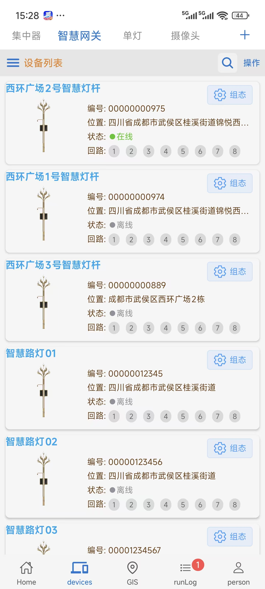
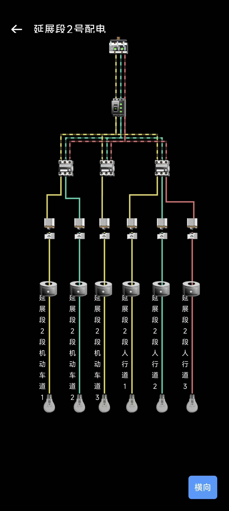
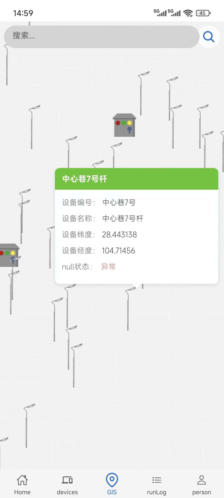

# Tabs Component App

一个使用 Expo 构建的现代化 React Native 应用程序，具有先进的 UI 组件和动画效果，仅为演示DEMO项目。

## 功能特点

- 🎨 使用 TailwindCSS 和 NativeWind 的现代化 UI
- 🔄 使用 React Native Reanimated 的流畅动画
- 👆 使用 React Native Gesture Handler 的高级手势处理
- 📱 跨平台支持（iOS、Android、Web）
- 🎯 TypeScript 支持
- 📊 使用 React Native Gifted Charts 的数据可视化
- 📸 相机和媒体库集成
- 📍 位置服务
- 🔒 安全存储功能
- 🌐 WebRTC 支持
- 📱 底部表单和模态框交互
- 🎭 使用 @legendapp/motion 的自定义动画

## 技术栈

### 核心技术

- React Native 0.79.2
- Expo SDK 53
- TypeScript
- TailwindCSS
- NativeWind

### UI 和动画

- React Native Reanimated
- React Native Gesture Handler
- @legendapp/motion
- @gorhom/bottom-sheet
- React Native Gifted Charts
- React Native Carousel

### 导航

- Expo Router
- React Navigation
- Bottom Tabs
- Material Top Tabs

### 存储和状态管理

- AsyncStorage
- Zustand
- Expo Secure Store

### 媒体和硬件

- Expo Camera
- Expo Image Picker
- Expo Media Library
- Expo Location
- React Native WebRTC

## 开始使用

### 环境要求

- Node.js
- npm 或 yarn
- Expo CLI
- iOS 模拟器（用于 iOS 开发）
- Android Studio（用于 Android 开发）

### 安装步骤

1. 正常 clone install
2. 需要登陆 eas (eas login)并打包基座 eas build -p all/android/ios --profile production/development
3. 打包完成后即可正常使用 启动 `npx expo start`

## 项目结构

```
tabs-component-app/
├── app/                 # 主应用代码
├── components/          # 可复用组件
├── assets/             # 静态资源
├── scripts/            # 构建和工具脚本
└── ...
```

## 许可证

本项目为私有项目。

## 项目部分截图





